# EchoAgent — Autonomous AI Research Intelligence Agent

[](https://n8n.io)
[](https://groq.com)
[](https://supabase.com)
[](https://react.dev)
[](https://tailwindcss.com)

**EchoAgent** is an end-to-end autonomous research intelligence pipeline orchestrated entirely in **n8n**. It continually scans academic feeds (arXiv), developer communities (Hacker News), and machine learning labs (Hugging Face RSS), evaluates content relevance with ultra-low latency LLMs (Groq), synthesizes executive briefings, and delivers structured findings directly to **Supabase** and an interactive **React Dashboard** via bidirectional webhooks.

---

## Autonomous Agent Workflow Architecture

The core of EchoAgent is an industrial-grade **n8n workflow** designed for high reliability, fault tolerance, and zero duplicate spam.

```mermaid
flowchart LR
    subgraph Triggers ["Execution Triggers"]
        T1[Daily Schedule<br/>07:00 AM]
        T2[Webhook Trigger<br/>Dashboard 'Run Now']
    end

    subgraph Ingestion ["Multi-Source Ingestion"]
        S1[Fetch arXiv Papers<br/>Rate-Limit Protected]
        S2[Fetch Hacker News<br/>Algolia API]
        S3[Fetch Hugging Face<br/>RSS Feed]
        NORM[Normalize & Merge<br/>Unified Schema]
    end

    subgraph Intelligence ["Agentic Reasoning & Memory"]
        MEM[Deduplication Memory<br/>Persistent URL Cache]
        GROQ1[AI Relevance Scoring<br/>Groq Llama-3]
        EXT[Extract & Score Parser]
        FILTER{Relevance >= 6?}
        GROQ2[Executive Summarizer<br/>2-Sentence Takeaways & Why It Matters]
    end

    subgraph Delivery ["Persistence & Delivery"]
        FMT[Format Output Feed<br/>Standard Schema]
        DB[(Save to Supabase<br/>PostgreSQL REST API)]
        WH[Respond to Webhook<br/>Instant Dashboard Feed]
    end

    T1 --> S1
    T2 --> S1
    S1 --> S2
    S2 --> S3
    S3 --> NORM
    NORM --> MEM
    MEM --> GROQ1
    GROQ1 --> EXT
    EXT --> FILTER
    FILTER -->|Qualified| GROQ2
    GROQ2 --> FMT
    FMT --> DB
    DB --> WH
```



---

## n8n Workflow Highlights

The workflow file is located at [`n8n/echoagent-workflow.json`](n8n/echoagent-workflow.json).

### 1. Multi-Trigger Orchestration
- **Scheduled Cycle**: Automatically runs daily at 7:00 AM via `Schedule Trigger`.
- **On-Demand Webhook**: Triggered instantly from the React Dashboard with user-defined topics and relevance thresholds.

### 2. Rate-Limit Resilient Ingestion
- Ingests latest research from **arXiv API**, **Hacker News Algolia API**, and **Hugging Face Blog RSS**.
- Configured with custom `User-Agent` headers and `continueRegularOutput` error handling to prevent API throttling from breaking the pipeline.

### 3. Workflow Deduplication Memory
- Employs `$getWorkflowStaticData('global')` to cache seen URLs across execution cycles.
- Prevents redundant alerts: newly published items are ingested and scored, while previously processed items are filtered out automatically.

### 4. Two-Stage LLM Evaluation (Groq Cloud)
- **Stage 1 (Relevance Scoring)**: Fast scoring against user research topics (e.g. Agentic AI, RAG, n8n, Production LLMs) returning a strict 1-10 relevance score.
- **Stage 2 (Executive Synthesis)**: Articles scoring $\ge 6$ receive a structured synthesis:
  - Concise 2-3 sentence core discovery summary
  - Single punchy *"Why It Matters"* production takeaway

### 5. Dual Delivery: Supabase & Instant Dashboard Webhook
- **Supabase Persistence**: Automatically upserts scored intelligence to the `digest_items` table in Supabase PostgreSQL.
- **Direct Webhook Response**: Utilizes n8n's `Respond to Webhook` node to return the fresh intelligence payload directly to the React Dashboard in real time.

---

## Project Structure

```
EchoAgent/
├── n8n/
│   ├── echoagent-workflow.json # Complete exportable n8n workflow (14 nodes)
│   ├── Dockerfile              # Production container config
│   ├── package.json            # Local n8n launcher
│   └── .env.example            # Environment template for n8n
├── frontend/                   # Interactive React Dashboard
│   ├── src/
│   │   ├── api/                # Webhook & digest API queries
│   │   ├── components/         # Dashboard feeds, filters & preferences modal
│   │   ├── context/            # AuthContext with persistent account registry
│   │   └── pages/              # Dashboard, Login, Register, Detail
│   ├── package.json
│   └── vite.config.js
├── supabase/                   # Database schemas & seed data
├── .gitignore                  # Excludes .env, sqlite, node_modules
└── README.md
```

---

## How to Import & Run the Workflow in n8n

### Option A: Import into Existing n8n Instance
1. Open your n8n canvas (`http://localhost:5678` or hosted cloud).
2. Click **Workflow** menu (top right) $\rightarrow$ **Import from File...**
3. Select [`n8n/echoagent-workflow.json`](n8n/echoagent-workflow.json).
4. Configure credentials:
   - **Groq API**: Add your Groq API Key in node settings or environment variable `GROQ_API_KEY`.
   - **Supabase (Optional)**: Configure your Supabase URL and Anon Key.
5. Click **Save** and toggle the workflow **Active**.

### Option B: Run Locally from Source
```bash
# 1. Clone repository
git clone https://github.com/your-username/EchoAgent.git
cd EchoAgent

# 2. Start n8n engine (Terminal 1)
cd n8n
npm install
npm start
# n8n opens at http://localhost:5678

# 3. Start Frontend Dashboard (Terminal 2)
cd ../frontend
npm install
npm run dev
# Dashboard opens at http://localhost:5173
```

---

## Environment Variables

Copy `.env.example` to `.env` in the root or `n8n/`:

```env
GROQ_API_KEY=gsk_your_groq_api_key_here
VITE_SUPABASE_URL=https://your-project.supabase.co
VITE_SUPABASE_ANON_KEY=your_supabase_anon_key
```

---

## Author & Portfolio Showcase
Built to demonstrate autonomous agentic workflows, multi-source ingestion pipelines, LLM-based filtering, and production integration with n8n.
