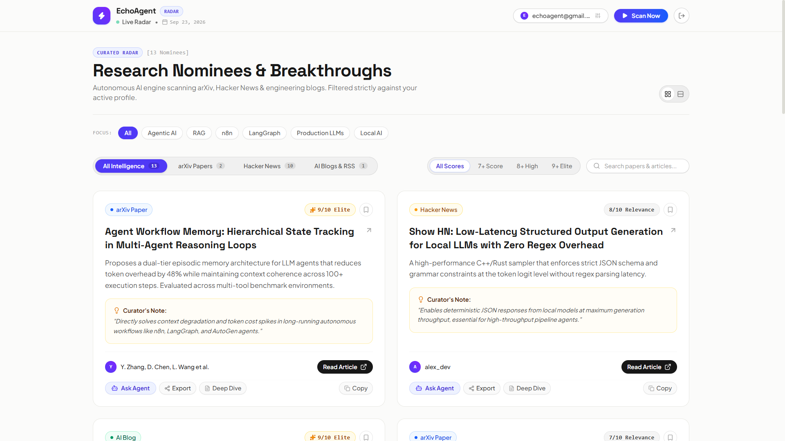
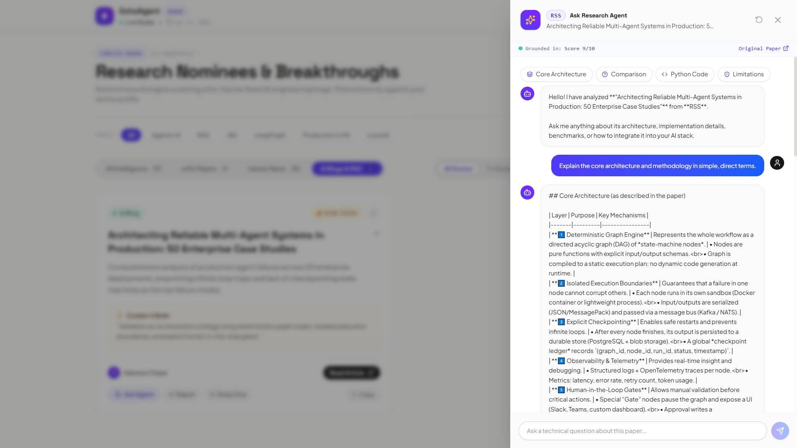
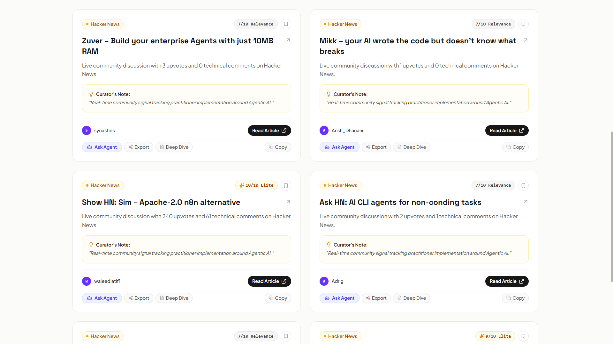
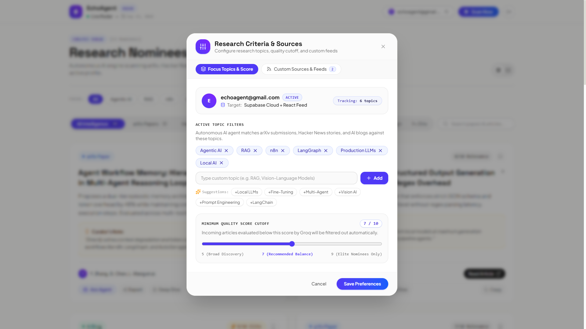
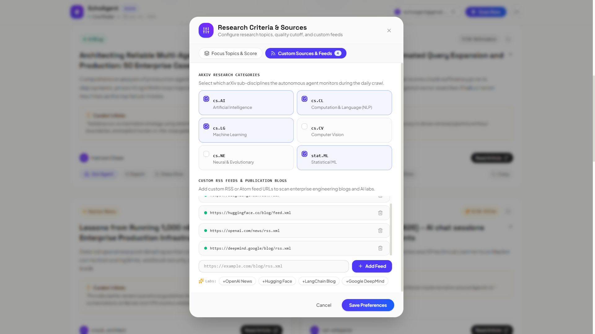
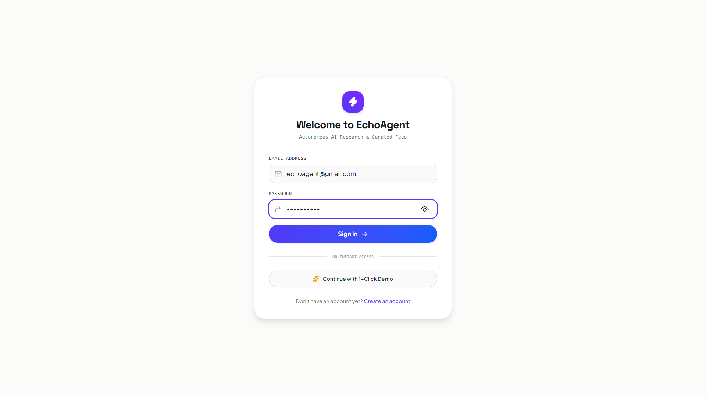
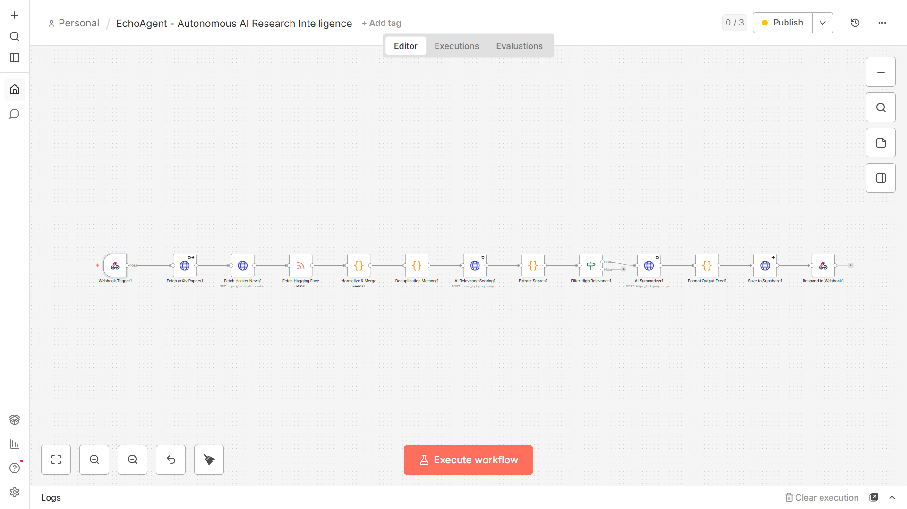

# EchoAgent — Autonomous AI Research Intelligence Agent

[](https://n8n.io)
[](https://groq.com)
[](https://supabase.com)
[](https://react.dev)
[](https://tailwindcss.com)
[](https://telegram.org)

**EchoAgent** is an end-to-end autonomous research intelligence agent and real-time radar dashboard. It continuously monitors academic research (**arXiv**), developer communities (**Hacker News**), and leading AI labs (**Hugging Face, OpenAI, DeepMind RSS**), scores breakthrough relevance via **Groq LLMs**, synthesizes executive takeaways, and delivers actionable briefings across **Telegram**, **Supabase**, and an interactive **React Research Dashboard**.

---

## Visual Showcase

### Live Radar & Curated Research Feed


<div align="center">
  <sub>Modern gallery layout with 2-tier responsive action cards, live quality ratings, and dynamic topic filtering.</sub>
</div>

### Interactive "Ask Agent" & Pipeline Execution
| Interactive "Ask Agent" (Groq Q&A) | Autonomous Scan Pipeline |
| :---: | :---: |
|  |  |
| <sub>Instant technical Q&A grounded in paper takeaways</sub> | <sub>Real-time multi-source ingestion & Groq LLM scoring</sub> |

### Preferences, Custom Feeds & Authentication
| Profile & Research Preferences | Filtered Topic Intelligence |
| :---: | :---: |
|  |  |
| <sub>Dynamic focus topics, quality cutoff & custom feeds</sub> | <sub>Topic-isolated research breakthroughs & curator notes</sub> |

<div align="center">
  
  <br/>
  <sub>Authentication with instant 1-Click Demo mode</sub>
</div>

---

## Core Capabilities

### 1. Autonomous Multi-Source Ingestion
- **arXiv Academic Feed**: Rate-limit protected ingestion of recent papers matching active categories (`cs.AI`, `cs.CL`, `cs.LG`, `cs.CV`, `stat.ML`).
- **Hacker News Algolia API**: Real-time monitoring of community discussions, trending tools, and open-source models.
- **AI Labs RSS Feeds**: Automated aggregation of engineering blogs from LangChain, Hugging Face, OpenAI, and Google DeepMind.

### 2. Two-Stage LLM Evaluation & Curation (Groq Cloud)
- **Stage 1: Relevance Scoring (1–10)**: Fast classification against active user focus topics (Agentic AI, RAG, n8n, LangGraph, Production LLMs).
- **Stage 2: Executive Synthesis**: For high-scoring breakthroughs, generates:
  - 2-sentence executive summary highlighting the core technical innovation.
  - Strategic *"Curator's Note"* explaining why it matters for production AI stacks.

### 3. Interactive "Ask Agent" Research Assistant
- Slide-over AI research drawer powered by **Groq (`openai/gpt-oss-120b` / `openai/gpt-oss-20b`)**.
- Pre-grounded in the paper's title, executive summary, curator notes, and abstract excerpt.
- 1-click prompt chips: *Core Architecture*, *Comparison to LangGraph/RAG*, *Python Pseudocode*, and *Limitations & Failure Modes*.

### 4. 1-Click Multi-Format Export
- **Obsidian / Notion**: Full YAML frontmatter, tags, executive summary, and curator notes.
- **LinkedIn & X Post**: Formatted social post with key takeaways and hashtags.
- **Executive Team Brief**: Formatted bullet points for Slack or Microsoft Teams.
- **Direct `.md` File Download**: 1-click download of the generated markdown file.

### 5. Multi-Channel Distribution
- **Interactive React Dashboard**: Responsive gallery layout with light aesthetics, dot badges, single/two-column views, and keyword search.
- **Automated Telegram Delivery**: Formatted notifications dispatched directly to user's Telegram chat via `@MyEchoAgent_bot`.
- **Supabase Cloud / Local Database**: Persistent storage for user preferences and research items with local browser fallback.

---

### Autonomous n8n Workflow Canvas


<div align="center">
  <sub>Full industrial-grade n8n workflow: On-demand Webhook ingestion, multi-source merging, persistent deduplication cache, Groq LLM scoring, and dual delivery.</sub>
</div>

---

## Architecture & Data Flow

```mermaid
flowchart LR
    subgraph Trigger ["Execution Trigger"]
        T1[Webhook Trigger<br/>Dashboard 'Scan Now']
    end

    subgraph Ingestion ["Multi-Source Ingestion"]
        S1[Fetch arXiv Papers<br/>Dynamic Categories]
        S2[Fetch Hacker News<br/>Algolia API]
        S3[Fetch AI Labs<br/>Custom RSS Feeds]
        NORM[Normalize & Merge<br/>Unified Schema]
    end

    subgraph Intelligence ["Agentic Reasoning & Memory"]
        MEM[Deduplication Memory<br/>Persistent URL Cache]
        GROQ1[AI Relevance Scoring<br/>Groq Engine]
        EXT[Score Extraction & Parsing]
        FILTER{Relevance >= Threshold?}
        GROQ2[Executive Summarizer<br/>2-Sentence Takeaways & Curator Notes]
    end

    subgraph Delivery ["Distribution & Persistence"]
        DB[(Save to Supabase<br/>PostgreSQL REST API)]
        WH[Respond to Webhook<br/>Instant Dashboard Feed]
    end

    T1 --> S1
    S1 --> S2
    S2 --> S3
    S3 --> NORM
    NORM --> MEM
    MEM --> GROQ1
    GROQ1 --> EXT
    EXT --> FILTER
    FILTER -->|Qualified| GROQ2
    GROQ2 --> DB
    GROQ2 --> WH
```



---

## Project Structure

```
EchoAgent/
├── n8n/
│   ├── echoagent-workflow.json   # Exportable n8n workflow (Multi-source, Groq LLM, Telegram)
│   ├── Dockerfile                # Production container deployment
│   ├── package.json              # Local n8n engine launcher
│   └── .env.example              # Environment variables template
├── frontend/                     # Modern React 19 + Vite Dashboard
│   ├── src/
│   │   ├── api/
│   │   │   ├── groqClient.js     # Client for Ask Agent interactive assistant
│   │   │   ├── supabase.js       # Supabase database client
│   │   │   └── useDigests.js     # React Query hooks & multi-source fallback
│   │   ├── components/
│   │   │   ├── common/           # Header, AnalyticsBar, RunNowModal
│   │   │   ├── digest/           # DigestCard, FilterBar, AskAgentDrawer, ExportModal
│   │   │   └── settings/         # PreferencesModal (Topics, arXiv, RSS)
│   │   ├── context/              # AuthContext (Supabase + LocalStorage persistence)
│   │   ├── pages/                # Dashboard, Login, Register, DigestDetail
│   │   └── utils/                # Mock data & baseline nominees
│   ├── package.json
│   └── vite.config.js
├── supabase/
│   ├── schema.sql                # Tables for user_preferences and digest_items
│   └── seed.sql                  # Initial benchmark research nominees
├── docs/
│   └── screenshots/              # Screenshots for visual documentation
├── .gitignore                    # Excludes .env, node_modules, and cache files
└── README.md
```

---

## Quick Start

### 1. Prerequisites
- **Node.js**: v18 or later
- **Groq API Key**: Free tier from [console.groq.com](https://console.groq.com)
- **Telegram Bot (Optional)**: Created via `@BotFather`

### 2. Setup Environment Variables
Create `.env` in the root and in `frontend/`:

```env
# Groq Inference Key
GROQ_API_KEY=gsk_your_groq_api_key_here
VITE_GROQ_API_KEY=gsk_your_groq_api_key_here

# Telegram Notification Settings (Optional)
TELEGRAM_BOT_TOKEN=your_bot_token_from_botfather
TELEGRAM_CHAT_ID=your_chat_id

# Supabase Settings (Optional - fallback to local storage if omitted)
VITE_SUPABASE_URL=https://your-project.supabase.co
VITE_SUPABASE_ANON_KEY=your_supabase_anon_key
VITE_N8N_WEBHOOK_URL=http://localhost:5678/webhook/trigger-digest
```

### 3. Run the Frontend Dashboard
```bash
cd frontend
npm install
npm run dev
```
Open **`http://localhost:5173`** in your browser.

### 4. Run the n8n Workflow Engine (Optional)
```bash
cd n8n
npm install
npm start
```
Open **`http://localhost:5678`**, navigate to **Workflows -> Import from File**, and select `n8n/echoagent-workflow.json`.

---

## Usage Guide

1. **Discover Breakthroughs**:
   - Filter by source (**All**, **arXiv**, **Hacker News**, **AI Blogs**).
   - Filter by quality score (**7+ Balanced**, **8+ High**, **9+ Elite**).
   - Search across titles, author names, takeaways, and notes.
2. **Read the Original Publication**:
   - Click the prominent **`Read Article ↗`** button on any card to open the source directly.
3. **Ask the Research Agent**:
   - Click **`Ask Agent`** on any card to query Groq for architecture teardowns, pseudocode, or comparisons.
4. **Export Your Research**:
   - Click **`Export`** to copy formatted notes for Obsidian/Notion, generate a LinkedIn post, or download a `.md` file.
5. **Customize Sources**:
   - Click **`Preferences`** in the header to configure custom focus topics, toggle arXiv categories, or add custom RSS URLs.

---

## License & Credits
Built for AI engineers, researchers, and automated knowledge pipelines. Powered by [n8n](https://n8n.io) and [Groq](https://groq.com).
